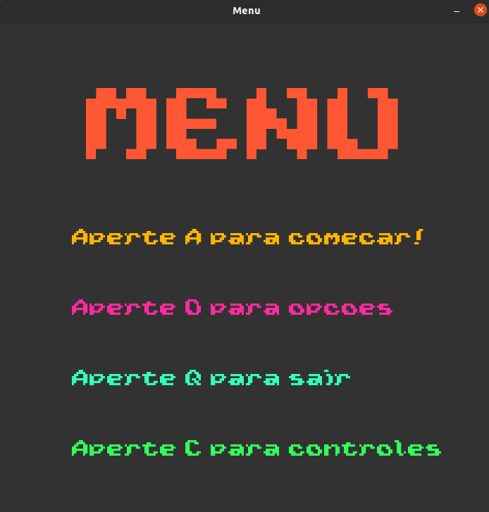
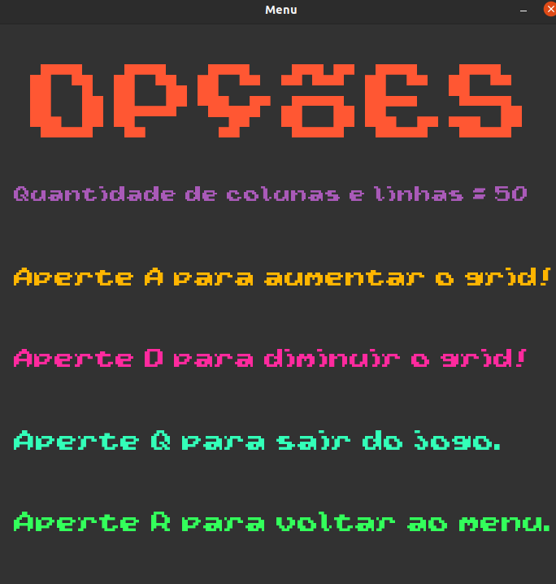
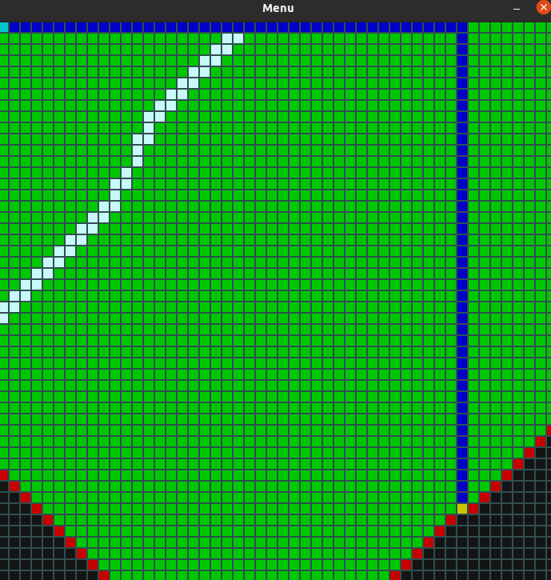

# Algorithm Viz

**Número da Lista**: 5 
**Conteúdo da Disciplina**: Trabalho Final 

## Alunos
|Matrícula | Aluno |
| -- | -- |
| 17/0013693  |  Joao Gabriel Rossi |
| 19/0026600  |  Davi Marinho da Silva Campos |

## Sobre 
Uma ferramenta de visualização que utiliza do usuário para construir um caminho para o teste do algoritmo de dijkstra e por BFS. Utiliza métodos de jogo para facilitar a utilização.

## Screenshots
### Menu

### Tela de opções

### Finalização do algoritmo com o melhor caminho

## Instalação 
**Linguagem**: Python 
**Framework**: Pygame 
Para rodar o projeto é necessário apenas de possuir Python e Pygame.
Para instalar o Pygame, rode o comando compatível com sua versão do Python: 
- `pip install pygame`
- `pip3 install pygame`

## Uso 
Para rodar o programa, entre na pasta do clone e digite o comando compatível com sua versão do Python:
- `python src/main.py` 
- `python3 src/main.py`

